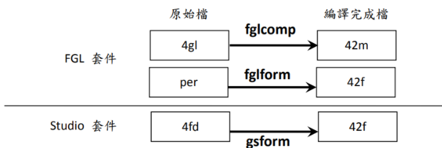
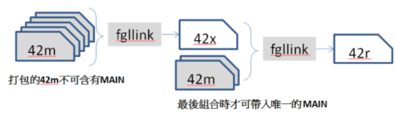

## 编译




### 程式（Module）的编译

1. &include "common_action.4gl" 可引入其它 4gl 文件
1. &define MAX_LINE 1000 预定义常量
1. &ifdef (&else) &endif

&define IS_DEFINED &ifdef IS_DEFINED DISPLAY ‘defined!’ &endif
可决定哪些需要编译，哪些不需要编译

### 画面（Form）的编译

```shell
fglform [编译参数] 画面挡名称[.per]
```

```shell
gsform [编译参数] 画面挡名称[.4fd]
```

## 连结流程

> 如果程序作为单独运行，不调用外部子函数，可以不执行连结操作，直接编译后运行。

> 如果程序被分为多个子函数，需要将所有程序先连结再将子函数的 42m 文件打包为 42x 文件，后将 42x 文件和主程序做连结，产生一只作业执行。
 



1. 将子函数打包为 42x 文件

```shell
fgllink -o test.42x test1.42m test2.42m test3.42m
```

2. 将子函数、42x 文件、主程序打包问 42r 可执行文件

```shell
fgllink -o program.42r test.42x main.42m others.42m
```

## 执行程序

> 执行前需要安装 GDC，保证端口一致

```shell
fglrun [执行参数] 执行文件名[.42r]
```

> 当程序未调用子函数，直接执行 42m 文件也可以。
