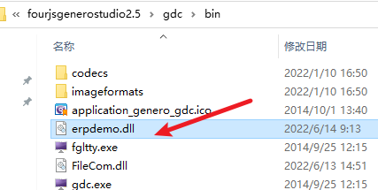

# fgl BDL调用dll库
---

## MAC 和LINUX 原则上都支持
.dyLib 和 .so 都支持，因为用户较少所以未测试。

## 利用vs开发

在新建项目中选择此项


  


## 新增头文件

文件名随意，以下代码申明了需要的数据结构，调用时，通过此struct进行传参和接受回传。

```cpp
#pragma once
struct frontEndInterface
{
	short (*getParamCount) ();
	short (*getReturnCount) ();
	void (*popInteger) (long&, short&);
	void (*pushInteger) (const long, short);
	void (*popString) (char*, short&, short&);
	void (*pushString) (const char*, short, short);
	void (*getFrontEndEnv) (const char*, char*, short&);
	void (*popWString) (wchar_t*, short&, short&);
	void (*pushWString) (const wchar_t*, short, short);
};
#ifdef WIN32
#define EXPORT extern "C" __declspec(dllexport)
#else
#define EXPORT extern "C"
#endif
// 下面时你要实现的函数。
EXPORT void initialize();
EXPORT void finalize();
EXPORT int mysum(const frontEndInterface& fx);
```

## 编写实现函数

需要导入刚才完成的头文件，我这里是`#include "erpdemo.h"`。

```cpp

// dllmain.cpp : 定义 DLL 应用程序的入口点。
#include "pch.h" 
#include "erpdemo.h"
#include <stdio.h>
#include <string.h>
/*
BOOL APIENTRY DllMain( HMODULE hModule,
                       DWORD  ul_reason_for_call,
                       LPVOID lpReserved
                     )
{
    switch (ul_reason_for_call)
    {
    case DLL_PROCESS_ATTACH:
    case DLL_THREAD_ATTACH:
    case DLL_THREAD_DETACH:
    case DLL_PROCESS_DETACH:
        break;
    }
    return TRUE;
}
这部分为vs自动生成。
*/

void initialize() {
}
void finalize() {
}
int mysum(const struct frontEndInterface& fci) {
    long param1, param2;
    short isNull1, isNull2;
    long sum;
    char msg[255];
    if (fci.getParamCount() != 2 || fci.getReturnCount() != 2) {
        return -1;
    }
    fci.popInteger(param2, isNull2);
    fci.popInteger(param1, isNull1);
    sum = param1 + param2;
    if (!isNull1 && !isNull2) {
        sum = param1 + param2;
        sprintf_s(msg, "%d + %d = %d", param1, param2, sum);
    }
    else {
        sum = 0;
        sprintf_s(msg, "Parameters are NULL");
    }
    fci.pushInteger(sum, 0);
    fci.pushString(msg, strlen(msg), 0);
    return 0;
}
```

## debug时会生成dll文件，将文件拷贝到gdc所在目录
 
 



## BDL 调用

``` sql
-- erpdemo 为dll名
-- mysum 为调用的函数名
-- [100,250] 为参数列表
-- [res,msg] 为回传的结果
CALL ui.Interface.frontCall("erpdemo", "mysum", [100,250], [res,msg])
```