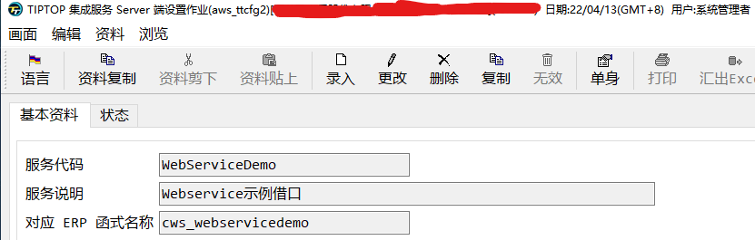
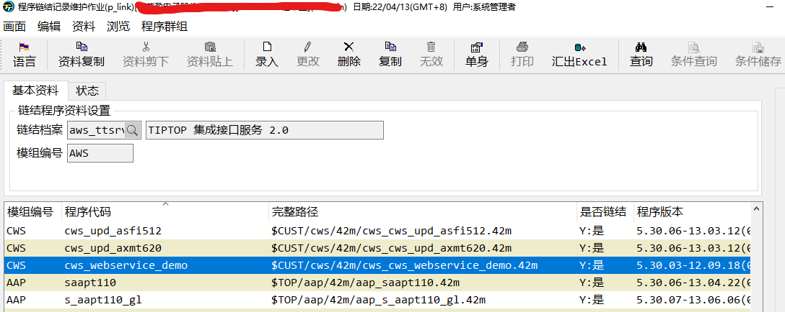
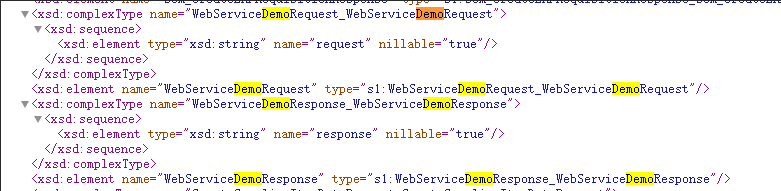

## 取名并建立接口资料

作业`aws_ttcfg2`中建立 demo 资料


服务代码:WebServiceDemo
对应 erp 函数名称:cws_webservicedemo

## 建立接口主体程序

程序代码`cws_webservice_demo.4gl`
入口函数`cws_webservice_demo`
入口函数不需要和程序代码相同

```sql
# Prog. Version..: '5.30.03-12.09.18(00000)'
# Program name...: cws_webservice_demo.4gl
# Descriptions...: 获取到货单和批次条码信息
# Date & Author..: darcy: add 20220321


DATABASE ds


GLOBALS "../../config/top.global"
GLOBALS "../../../tiptop/aws/4gl/aws_ttsrv_global.4gl"

    DEFINE g_bmb  DYNAMIC ARRAY OF RECORD
                    bmb03                   LIKE bmb_file.bmb03,
                    ima02                   LIKE ima_file.ima02,
                    ima021                  LIKE ima_file.ima021
                END RECORD
    DEFINE g_bma    RECORD
                    bma01                   LIKE bma_file.bma01,
                    ima02                   LIKE ima_file.ima02,
                    ima021                  LIKE ima_file.ima021
            END RECORD

FUNCTION cws_webservice_demo()

    WHENEVER ERROR CONTINUE

    CALL aws_ttsrv_preprocess()    #呼叫服務前置處理程序 #FUN-860037

    #--------------------------------------------------------------------------#
    # 查詢 ERP 客戶編號                                                    #
    #--------------------------------------------------------------------------#
    IF g_status.code = "0" THEN
       CALL cws_webservice_demo_process()
    END IF

    CALL aws_ttsrv_postprocess()   #呼叫服務後置處理程序
END FUNCTION


FUNCTION cws_webservice_demo_process()
    DEFINE l_cnt,l_i,l_cnt1,l_cnt2,l_cnt3        LIKE type_file.num5
    DEFINE l_k,l_j,l_l,l_m,l_n                   LIKE type_file.num5
    DEFINE l_node1    om.DomNode,
           l_node2    om.DomNode,
           l_node3    om.DomNode

    LET l_cnt1 = aws_ttsrv_getMasterRecordLength("")
    #TAG:取总资料笔数

    IF l_cnt1 = 0 THEN
      LET g_status.code = "-1"
      LET g_status.description = "无资料!"
      LET g_success='N'
      RETURN
    END IF

    FOR l_i = 1 TO l_cnt1
        LET l_node1 = aws_ttsrv_getMasterRecord(l_i, "")
        #TAG:当前处理的节点

        LET g_bma.bma01 = aws_ttsrv_getRecordField(l_node1,"bma01")
        #TAG: 单头取值

        LET l_cnt3 = aws_ttsrv_getDetailRecordLength(l_node1, "")
        #TAG:单身笔数

        CALL g_bmb.clear()
        FOR l_k = 1 TO l_cnt3
            LET l_node3 = aws_ttsrv_getDetailRecord(l_node1, l_k,"")
            #TAG:当前处理的单身节点
            LET g_bmb[l_k].bmb03  = aws_ttsrv_getRecordField(l_node3, "bmb03")

        END FOR

        CALL g_bmb.deleteElement(l_k)
        LET l_k = l_k - 1

        CALL cws_webservice_demo_get()
        #TAG:返回报文

    END FOR

END FUNCTION

FUNCTION cws_webservice_demo_get()
    DEFINE i        LIKE type_file.num5
    DEFINE l_node      om.DomNode

    SELECT bma01,ima02,ima021 INTO g_bma.bma01,g_bma.ima02,g_bma.ima021
      FROM bma_file,ima_file
     WHERE bma01 = g_bma.bma01 AND bmaacti ='Y'
       AND ima01 = bma01
    IF STATUS THEN
        LET g_bma.ima02 = '无此BOM主键'
        RETURN
    END IF

    FOR i = 1 TO g_bmb.getLength()
        SELECT bmb03,ima02,ima021 INTO g_bmb[i].ima02,g_bmb[i].ima021
          FROM ima_file,bmb_file,bma_file
         WHERE bmb01 = bma01 and bmaacti ='Y' AND ima01 = bmb03
           AND bma01 = g_bma.bma01 and bmb03 = g_bmb[i].bmb03
        IF STATUS THEN
            LET g_bmb[i].ima02 = '无此BOM下阶料!'
        END IF
    END FOR

    LET l_node = aws_ttsrv_addMasterRecord(base.TypeInfo.create(g_bma), "bma_file")
    CALL aws_ttsrv_addDetailRecord(l_node, base.TypeInfo.create(g_bmb), "bmb_file")

    IF SQLCA.SQLCODE THEN
       LET g_status.code = SQLCA.SQLCODE
       LET g_status.sqlcode = SQLCA.SQLCODE
       RETURN
    END IF

END FUNCTION


```

传给`webservice`的报文

```xml
<Request>
    <Access>
        <Authentication user="tiptop" password="tiptop" />
        <Connection application="SCM" source="127.0.0.1" />
        <Organization name="FOREWIN" />
        <Locale language="zh_cn" />
    </Access>
    <RequestContent>
        <Parameter></Parameter>
        <Document>
            <RecordSet>
                <Master id="1">
                    <Field name="bma01" value="BA0001A4HR" />
                    <Detail id="1">
                        <Record>
                            <Field name="bmb03" value="K.OT.0004R" />
                        </Record>
                    </Detail>
                    <Detail id="2">
                        <Record>
                            <Field name="bmb03" value="K.CA.0058R" />
                        </Record>
                    </Detail>
                </Master>
                <Master id="2">
                    <Field name="bma01" value="BA0001A4HR" />
                    <Detail id="1">
                        <Record>
                            <Field name="bmb03" value="K.OT.0004R" />
                        </Record>
                    </Detail>
                    <Detail id="2">
                        <Record>
                            <Field name="bmb03" value="K.CA.0058R" />
                        </Record>
                    </Detail>
                </Master>
            </RecordSet>
        </Document>

    </RequestContent>
</Request>
```

## 修改`aws_ttsrv2`的链接资料

 

## 修改 aws_ttsrv2_service 代码

- 在 `aws_ttsrv_serviceFunction` 函数中增加 `cws_webservicedemo` 的部分，`cws_webservicedemo` 对应 `aws_ttcfg2` 中的对应 erp 函数名称

```sql
WHEN "cws_webservicedemo"
	    LET l_op =com.WebOperation.CreateDOCStyle("cws_webservicedemo", p_op_name, g_request, g_response)
```

- 在`aws_ttsrv2_service`最后新增函数`cws_webservicedemo`,函数中调用的`cws_webservice_demo`对应新增的接口程序的入口函数

```sql
FUNCTION cws_webservicedemo()
  LET g_service = "WebServiceDemo"
  CALL cws_webservice_demo()
END FUNCTION
```

## 链接`aws_ttsrv2`

上述都编译成功后，链接`aws_ttsrv2`，为不影响使用可先备份`42r`，和`42m`目录下文件。

## 重新生成`WSDL`文件，并重新`webservice`

- `r.r2 aws_ttsrv2 -W http://192.168.1.19/web/ws/r/aws_ttsrv2`
- `startws`

## 重新打开 webservice 地址验证

    已经有新增的接口



